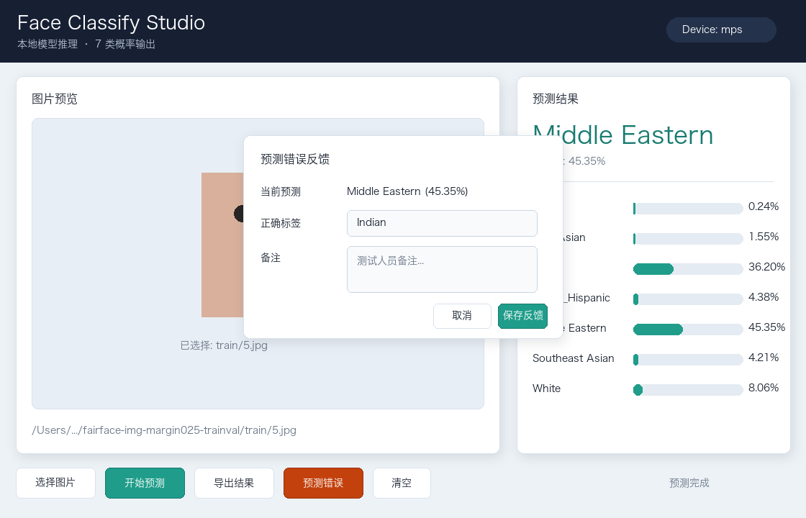
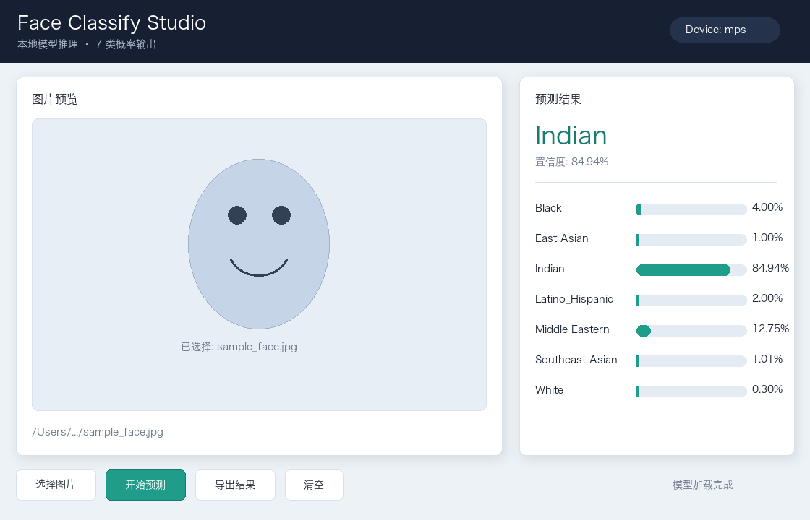

# Face Classify Studio

Face Classify Studio 是一个面向 7 类人脸种族识别实验的本地桌面端项目。项目基于 PyTorch + ResNet18 迁移学习训练模型，并提供 macOS 桌面应用进行单张图片推理、概率展示、结果导出和测试人员错误反馈。



## 功能亮点

- 7 分类输出：`Black`、`East Asian`、`Indian`、`Latino_Hispanic`、`Middle Eastern`、`Southeast Asian`、`White`
- ResNet18 ImageNet 预训练迁移学习
- 两阶段训练：先冻结主干训练分类头，再低学习率微调后层
- macOS MPS 自动加速，无法使用时回落 CPU
- 桌面端支持图片预览、Top-1 预测、7 类概率条、CSV 导出
- 测试人员反馈闭环：预测错误时选择正确标签，后续可用反馈样本微调模型



## 项目结构

```text
face_classify/
├── code/
│   ├── desktop_app.py              # 桌面应用
│   ├── inference.py                # 推理封装
│   ├── predict_one.py              # 单图命令行预测
│   ├── train_resnet18.py           # 主训练脚本
│   ├── train_feedback.py           # 反馈样本微调脚本
│   ├── import_fairface.py          # FairFace 数据导入
│   └── audit_dataset_quality.py    # 数据质量检查
├── model/
│   ├── best_resnet18_faces.pth     # 当前桌面端默认模型
│   └── training_metrics.json       # 当前训练指标
├── reports/
│   ├── desktop_app_preview.png
│   └── desktop_app_feedback_preview.png
├── requirements.txt
├── run_desktop_app.command
└── setup_and_run.command
```

## 一键部署教程

macOS 用户可以直接双击：

```text
setup_and_run.command
```

这个脚本会自动完成：

1. 创建本地虚拟环境 `.venv`
2. 安装 `requirements.txt` 中的依赖
3. 启动桌面端应用

如果 macOS 提示脚本没有执行权限，可以在项目目录运行：

```bash
chmod +x setup_and_run.command run_desktop_app.command
```

首次安装依赖后，之后也可以双击：

```text
run_desktop_app.command
```

## 手动运行

```bash
python3 -m pip install -r requirements.txt
python3 code/desktop_app.py
```

桌面端会默认加载：

```text
model/best_resnet18_faces.pth
```

## 单张图片预测

```bash
python3 code/predict_one.py path/to/image.jpg
```

输出会包含预测类别和 7 类概率。

## 模型训练

数据集使用 PyTorch `ImageFolder` 结构：

```text
data/
├── train/
│   ├── Black/
│   ├── East Asian/
│   └── ...
├── val/
└── test/
```

运行主训练：

```bash
python3 code/train_resnet18.py
```

推荐微调配置：

```bash
python3 code/train_resnet18.py --unfreeze layer3_layer4
```

训练脚本默认使用：

- 图像尺寸 `224 x 224`
- batch size `8`
- ImageNet 均值方差归一化
- 训练集随机增强，验证/测试集只做标准化
- AdamW 优化器
- 验证集准确率早停
- macOS `mps` 自动检测

训练输出：

```text
model/best_resnet18_faces.pth
model/training_metrics.json
```

## FairFace 数据导入

如果你本地有 FairFace 图片和标签 CSV，可以使用：

```bash
python3 code/import_fairface.py
```

脚本会按标签导入到 `data/train`、`data/val`、`data/test` 的 7 类目录中。

注意：本仓库不发布原始训练图片。请自行准备符合授权要求的数据集。

## 反馈闭环

桌面端预测完成后，如果测试人员发现结果错误，可以点击 `预测错误`：

1. 选择正确标签
2. 可选填写备注
3. 点击保存反馈

反馈样本会保存到：

```text
feedback/images/<正确标签>/
feedback/feedback_log.csv
```

累计一定数量反馈样本后，运行：

```bash
python3 code/train_feedback.py
```

这会生成反馈微调模型：

```text
model/best_resnet18_faces_feedback.pth
model/feedback_training_metrics.json
```

确认指标更好后，可以提升为桌面端默认模型：

```bash
python3 code/train_feedback.py --promote
```

## 当前模型表现

当前版本使用小样本迁移学习训练，最终测试集整体准确率约为 `36.43%`，macro F1 约为 `35.32%`。该项目更适合作为完整机器学习流程和桌面端原型展示，而不是直接用于高风险真实场景。

## 说明

本项目仅用于课程、实验和原型开发。人脸属性识别涉及公平性、隐私和伦理风险，请勿用于身份判断、自动化决策或任何可能影响个人权益的场景。
